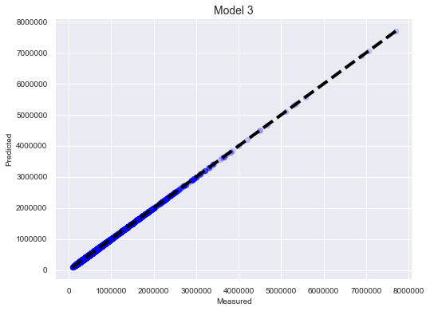

# King County House Sales
## A Regression Model


**Author**: Joseph Tang

## Overview

This project analyzes house sale prices in King County, WA. Regression modeling and descriptive analysis is used to look at possible predictors of sale prices in the region, with an eye toward finding houses that meet the needs of first-time home buyers.

## Business Problem

For many first-time home buyers, a new house is a big financial investment. This analysis looks at houses that will be relatively affordable for new home owners that will be move-in ready.

## Data

The dataset used are all house sales from King County in the state of Washington between May 2014 and May 2015, representing over twenty-one thousand transactions. The data file includes house attributes for each sale, including the sale date, number of bedrooms, the condition the house was in, the year it was built, etc. A complete table of all the attributes is included. 

</li>[King County Column Names & Descriptions](./notebooks_data/kchouse_columns.ipynb)</li>
<li>King County Base dataset: kc_house_data.csv - https://github.com/jtang1618/house-sale-king/blob/master/kc_house_data.csv</li>

## Methods

Exploratory analysis and regression modeling is used in this project to  prepare the data for further, iterative analysis. 

**Libraries used:**
NumPy, Pandas, Pandas-Profiling, SciPy, Seaborn, MatPlotLib, Folium, Cufflinks, Datetime, Sweetviz, StatsModel

## Results

King County, WA had a wide range of house sale prices, from $82,000 to $7.7 million. The iterative analysis showed that some of the biggest factors that contribute to the sale price of a house in the region are size of the living space and the quality of construction of the house (i.e. the design and material finishes). 
Final modeling gave very close Root Mean Squared Errors between the training and validation data sets, with an R-squared value of .753 in the OLS regression. 



## Conclusions

When looking at a first home in King County, WA, there are a few considerations to keep in mind:

<li>1) The median sale price in King County was $455,000, with the middle 50% of all homes selling between $325,000 and $650,000.</li>
<li>2) For a livable, move-in ready home, those with a building condition between 3 and 5 (no structural repairs needed), and evaluated as a Grade 6 or above are recommended (the lowest grade that meets building codes).</li>
<li>3) Though the total size of a home is important in its pricing, the size of the actual living areas in a home impact the sale price more than the lot size.</li>

Though moderately priced homes can be found throughout King County, these 10 towns and cities have the lowest median sales prices within an hour to the south and east of Seattle:
<li>Federal Way - $226, 687.50</li>
<li>Auburn - </li>
<li>Enumclaw</li>
<li>Kent</li>
<li>Maple Valley</li>
<li>Renton</li>
<li>Black Diamond</li>
<li>Duvall</li>
<li>North Bend</li>
<li>Carnation</li>

### Future Work
Further analysis could entail correlating sale prices to time of year and a more granular look at geographical location by neighborhood. Additionally, many of the variables reference other variables and a deeper analysis of interactions between variables would be beneficial for the modeling.


## For More Information

Please review the full analysis in the Jupyter Notebooks, [1_data_cleaning_eda](./notebooks_data/1_data_cleaning_eda.ipynb) & [2_kchouse_modeling.ipynb](./notebooks_data/2_kchouse_modeling.ipynb), and/or the accompanying [presentation](./kingcounty_housesales.pdf).

Joseph Tang at [joe@houseoftang.org ](mailto:joe@houseoftang.org)


## Repository Structure

```
├── archive                        
├── images
├── notebooks_data
├── .gitignore
├── README.md                          
└── kingcounty_housesales.pdf


